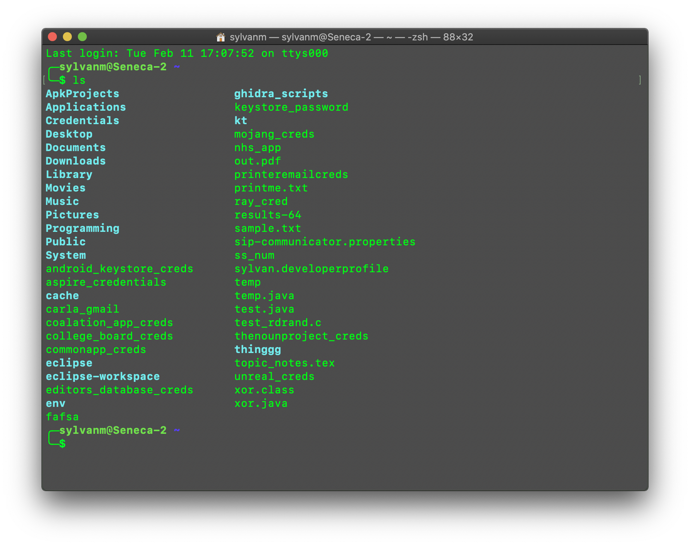

# Using the Command Line on a Mac

By Sylvan Martin

## What it is

The command line, or “shell” as it is most often referred to, is a way to interact with and use your computer which gives you more control than the regular GUI we are used to. While in the beginning it may be harder to use, it is worth having a basic understanding of how to use it as we will be using it a lot in the club.

## How it works

The shell is basically just the same thing as navigating through the “Finder” app on your computer. You can search through folders, create and edit files, and even run certain commands you may not otherwise have access to.

## Getting Started

On a Mac, you can access the shell through the Terminal application, which comes pre-installed on all Mac devices. To open the application, hit ⌘-Spacebar, then type “Terminal.” We recommend that you save this to your dock.


Upon opening the application, you will be greeted with what is called the Command Prompt. This is the $ you will see following your username on your computer. The exact layout will look different for everyone. Depending on your preferences, you can customize the color scheme of the shell. For example, I have green text on a black translucent background because I think it looks cool.


Now you are ready to start typing in commands! Notice the “~” (tilde) following your username, and before the $? That is telling you what directory you are in. (A directory is just a fancy word for a folder.) In this case, this means you are in the Home Directory. This is the same as if you were to open the finder Application to your home folder.

Before beginning commands, the convention for writing a command in plain text is:

```bash
command-goes-here
```

When you see a command in a `text box like this` on its own line, it is refering to a command to be run.

### Basic Commands

The commands you will use most often are the `ls` and `cd` commands. `ls` is a very simple command that tells the computer to list and display every file and directory (folder) inside of the current directory. So, if you are in your home directory, (which is the default directory when first opening the terminal) and you enter `ls`, it will show you everything in your home directory. Try it out.

```bash
ls
```

You should get a list of stuff, unless your home directory is empty. What you just did is the exact same thing as opening the Finder application and clicking the home button on the sidebar, and looking at what is there:


And here is what `$ ls` outputs on my computer:



Sure enough, we see the same stuff we would have seen in the Finder app (and a little bit more).
But listing whatever is in your current directory doesn't really help. We need to be able to actually move between folders and change directories, just as when using a GUI you can click on folders to open them. This is when the `cd` command comes in. To change directories, (open a folder to view or edit its contents) we enter

```bash
cd name-of-directory
```

where `name-of-directory` is where you want to go. (`cd` just stands for "change directory") For example, I have a programming folder in my home directory. If I wanted to access that from inside the Terminal, I could enter

```bash
cd Programming
```

from the home directory. It is important to remember that unless you put a `/` (which has a special meaning that will be addressed later) before the directory you are trying to go to, it will be treated as a **relative path.** This means that it will search for the desired directory within the directory you are currently in. For example, I have a folder called "Python" which is in my Programming folder, but I would not be able to run

```bash
cd Python
```

from my home directory, because "Python" is not directly accessible from the home folder, we have to enter the Programming folder first. We could either `cd` into the Python directory, or we could go to the Python directory directly via

```bash
cd Programming/Python
```

And now we are in the Python directory!

Let's talk about the symbols `~`, `.`, `..`, and `/`.

`~` refers to the **current user's home directory**. No matter where you currently are, it will always refer to that specific home directory. For example, if you have `cd`'d into a couple directories but want to jump right back to the home directory,

```bash
cd ~
```

will do the trick. You can also use `~` in paths, so you can refer to a specific file or folder in your home directory from anywhere. For example, if you've `cd`'d into your Documents folder but want to list everything in your Downloads folder without having to enter a whole bunch of `cd` commands, you can run

```bash
ls ~/Downloads
```

`.` refers to the current directory you are in. You may be thinking, why should I care about that? I'd never need to `cd` into a directory I'm already in, and I can run `ls` just by itself to see what files are here. Well, sometimes when running bash commands, you must tell it which directory to run the command on. For example, I have an IDE (An IDE is a software programmers use to write their code) called [Visual Studio Code](https://code.visualstudio.com/) (VSCode) installed. If I want to launch the IDE from a command line, I can enter

```bash
code
```

And VSCode will just pop open a new window for me to start writing whatever I need to. However, sometimes I want to open VSCode in a certain directory, meaning I want to **tell** VSCode "Hey, I want you to launch, but when you do, please open the files in this specific directory and let me edit this specific directory." If I want to make VSCode open whatever directory I'm currently in, I can just pass the `.` as an *argument* to the `code` command:

```bash
code .
```

I can also tell it any other path to open, for example:

```bash
code ~ # opens the home directory
```

```bash
code ~/Programming/Tutorials/commandline # this is actually the exact command I used today to write this
```

`..` is a litte bit different. It refers to the **parent directory** of the directory you are currently in. What does this mean? Well, as you may already know, directories are organized in a hierarchy. With some directories being nested in each other. When you're going through your files and you go into a bunch of folders, sometimes you want to go "back" a folder, meaning going to the folder that holds whatever folder you are in. This is what a parent directory is. It is the directory that is "one level up" or "one level back" from wherever you currently are.

Try this out yourself! Go into a directory two levels down, then enter `cd ..` twice to get back to your starting directory. Here's an example

```bash
cd Programming/Python
```

Now we will go back.

```bash
cd .. # we are now in the Programming directory
cd .. # and now we're back where we started
```

This seems a little irritating, having to type `cd ..` over and over. 