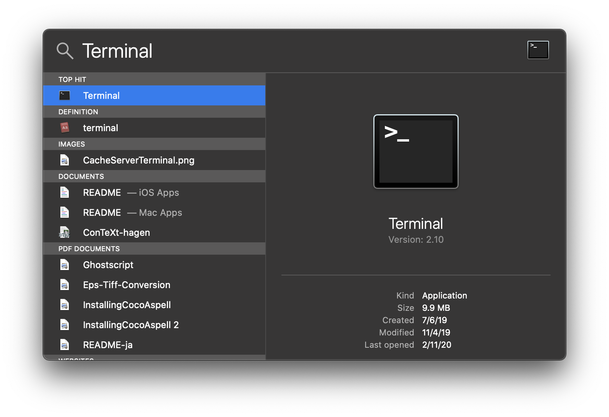
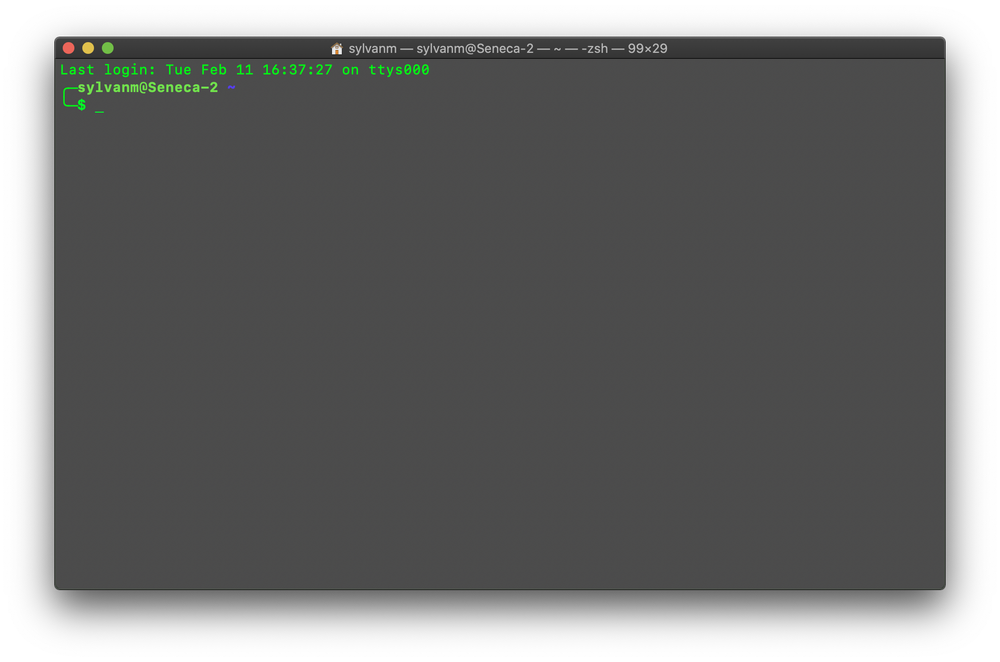
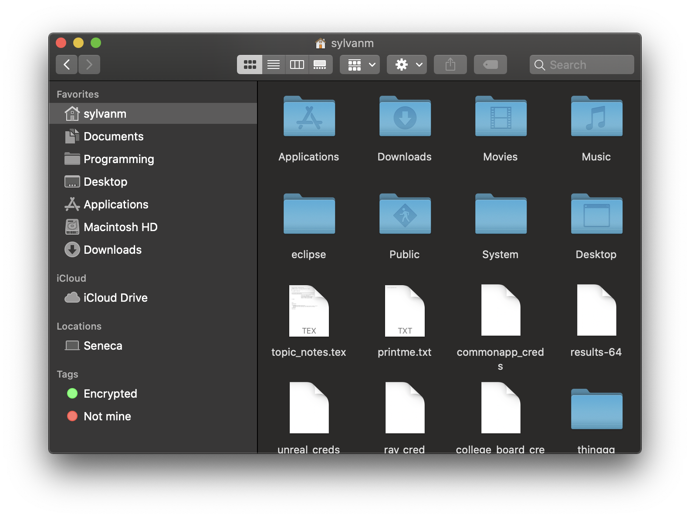

# Using the Command Line on a Mac

By Sylvan Martin

## What it is

The command line, or “shell” as it is most often referred to, is a way to interact with and use your computer which gives you more control than the regular GUI we are used to. While in the beginning it may be harder to use, it is worth having a basic understanding of how to use it as we will be using it a lot in the club.

## How it works

The shell is basically just the same thing as navigating through the “Finder” app on your computer. You can search through folders, create and edit files, and even run certain commands you may not otherwise have access to.

## Getting Started

On a Mac, you can access the shell through the Terminal application, which comes pre-installed on all Mac devices. To open the application, hit ⌘-Spacebar, then type “Terminal.” We recommend that you save this to your dock.



Upon opening the application, you will be greeted with what is called the Command Prompt. This is the $ you will see following your username on your computer. The exact layout will look different for everyone. Depending on your preferences, you can customize the color scheme of the shell. For example, I have green text on a black translucent background because I think it looks cool.



Now you are ready to start typing in commands! Notice the “~” (tilde) following your username, and before the $? That is telling you what directory you are in. (A directory is just a fancy word for a folder.) In this case, this means you are in the Home Directory. This is the same as if you were to open the finder Application to your home folder.

### Basic Commands

Before beginning commands, the convention for writing a command in plain text is:

```bash
$ command-goes-here
```

and that `$` character denotes that what follows is a command to be entered into a command prompt.
Moving on!

The commands you will use most often are the `ls` and `cd` commands. `ls` is a very simple command that tells the computer to list and display every file and directory (folder) inside of the current directory. So, if you are in your home directory, (which is the default directory when first opening the terminal) and you enter `ls`, it will show you everything in your home directory. Try it out.

```bash
$ ls
```

You should get a list of stuff, unless your home directory is empty. What you just did is the exact same thing as opening the Finder application and clicking the home button on the sidebar, and looking at what is there:


